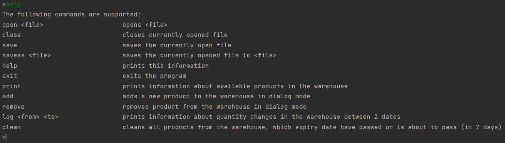

Todor Yordanov / Technical University of Varna / SIT / 4th semester / group: 4a /faculty number: 20621600

This is repository of my project based on Object-Oriented Programming(Java).

The project is about a Warehouse Management System.

  

